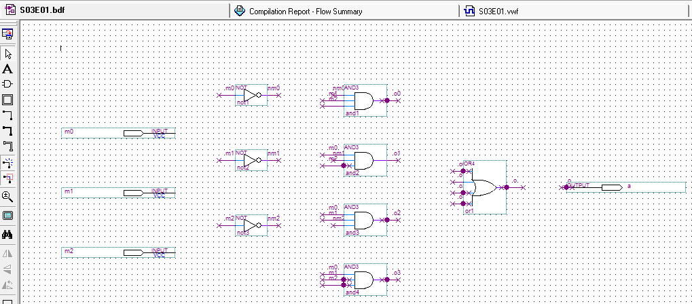
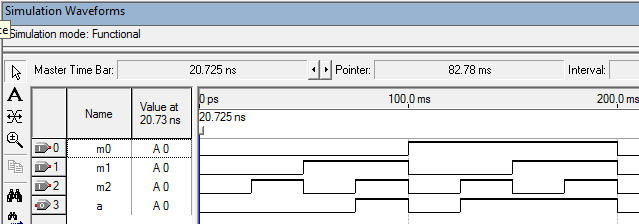
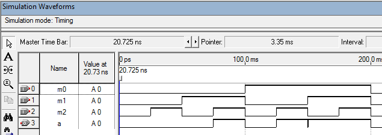

# engcomp-projdigital
Arquivos relativos à disciplina Projeto Digital do curso de Engenharia da Univesp.

## Semana 3
* Exercício 1

###Esquemático

###Simulação funcional

###Simulação com atraso de propagação
